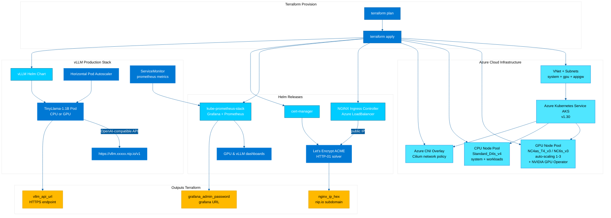

# 🧑🏼‍🚀 vLLM Production Stack on Azure AKS with Terraform
<!-- canvas.md -->

✍🏼 This Terraform stack delivers a **production-ready vLLM serving environment** on Azure AKS supporting both CPU/GPU inference with operational best practices, automated SSL/TLS certificate management via Let's Encrypt, and comprehensive observability.

| Project Item | Description |
|--------------|-------------|
| **Author** | [@cloudthrill](https://cloudthrill.ca) |
| **Stack** | Terraform ◦ Azure ◦ AKS ◦ Cilium ◦ Helm ◦ vLLM |
| **Module** | Highly customizable, lightweight AKS blueprint for deploying vLLM on enterprise-grade cluster |
| **CNI** | Azure CNI with **Cilium** network policy overlay |
| **Inference hardware** | Either CPU or GPU through a switch flag |

---

## 📋 Table of Contents

1. [Project Structure](#-project-structure)
2. [Prerequisites](#-prerequisites)
3. [What Terraform Deploys](#%EF%B8%8F-what-terraform-deploys)
4. [Hardware Options](#-hardware-options)
5. [Configuration Options](#%EF%B8%8Fconfiguration-options)
6. [Quick Start](#-quick-start)
7. [Quick Test](#-quick-test)
8. [Observability](#-observability)
9. [Troubleshooting](#-troubleshooting)
10. [Cleanup Notes](#-cleanup-notes)
11. [Additional Resources](#-additional-resources)

---

## 📂 Project Structure
```bash
./
├── main.tf
├── network.tf
├── provider.tf
├── variables.tf
├── output.tf
├── cluster-tools.tf
├── datasources.tf
├── vllm-production-stack.tf
├── env-vars.template
├── terraform.tfvars.template
├── modules/
│   ├── avm-res-cs-managedcluster/      # Azure Verified Module for AKS
│   │   ├── main.tf
│   │   ├── variables.tf
│   │   ├── outputs.tf
│   │   ├── terraform.tf
│   │   ├── locals.tf
│   │   ├── main.diagnostic.tf
│   │   ├── main.nodepool.tf
│   │   ├── main.privateendpoint.tf
│   │   ├── main.telemetry.tf
│   │   └── modules/
│   │       └── nodepool/
│   ├── az-networking/                   # Azure Networking Module
│   │   └── vnet/
│   │       ├── main.tf
│   │       ├── variables.tf
│   │       ├── outputs.tf
│   │       ├── terraform.tf
│   │       ├── data.tf
│   │       ├── locals.tf
│   │       ├── main.interfaces.tf
│   │       ├── main.peering.tf
│   │       ├── main.subnet.tf
│   │       ├── main.telemetry.tf
│   │       ├── main.virtual.network.tf
│   │       └── modules/
│   │           ├── peering/
│   │           └── subnet/
│   └── llm-stack/                       # vLLM Helm Charts
│       └── helm/
│           ├── cpu/
│           │   ├── cpu-tinyllama-light-ingress-azure.tpl
│           └── gpu/
│               ├── gpu-operator-values.yaml
│               └── gpu-tinyllama-light-ingress-azure.tpl
├── config/
│   ├── helm/
│   │   └── kube-prome-stack.yaml
│   ├── manifests/
│   │   └── letsencrypt-issuer.yaml
│   ├── kubeconfig.tpl
│   └── vllm-dashboard.json
└── README.md                            # ← you are here
```

---

## ✅ Prerequisites

| Tool | Version | Notes |
|------|---------|-------|
| **Terraform** | ≥ 1.9 | Tested on 1.9+ |
| **Azure CLI** | ≥ 2.50 | For authentication |
| **kubectl** | ≥ 1.30 | ±1 of control-plane |
| **jq** | optional | JSON helper |

<details>
<summary><b>Install tools (Ubuntu/Debian) 👇🏼</b></summary>

```bash
# Install tools
sudo apt update && sudo apt install -y jq curl unzip gpg

  # Terraform
wget -qO- https://apt.releases.hashicorp.com/gpg | sudo gpg --dearmor -o /usr/share/keyrings/hashicorp-archive-keyring.gpg
echo "deb [signed-by=/usr/share/keyrings/hashicorp-archive-keyring.gpg] https://apt.releases.hashicorp.com $(lsb_release -cs) main" | sudo tee /etc/apt/sources.list.d/hashicorp.list
sudo apt update && sudo apt install -y terraform

  # Azure CLI
curl -sL https://aka.ms/InstallAzureCLIDeb | sudo bash

# kubectl
curl -sLO "https://dl.k8s.io/release/$(curl -Ls https://dl.k8s.io/release/stable.txt)/bin/linux/amd64/kubectl"
sudo install kubectl /usr/local/bin/ && rm kubectl
```
</details>

**Configure Azure**
```bash
# Login to Azure
az login

# Set subscription (if you have multiple)
az account set --subscription "YOUR_SUBSCRIPTION_ID"

# Verify
az account show
```

---

## 🏗️ What Terraform Deploys

<div align="center">

| Layer | Component | CPU Mode | GPU Mode |
|-------|-----------|----------|----------|
| **Infrastructure** | VNet + AKS + Azure CNI Cilium | ✅ Always deployed | ✅ Always deployed |
| **Add-ons** | Azure Disk CSI, NGINX Ingress, Prometheus | ✅ Always deployed | ✅ Always deployed |
| **vLLM Stack** | Secrets + Helm chart | ✅ Deploy on CPU nodes | ✅ + GPU nodes + NVIDIA operator |
| **Networking** | Load Balancer + Ingress + TLS + Let's Encrypt | ✅ NGINX + cert-manager | ✅ NGINX + cert-manager |

</div>

### 1. 📶 Networking

* Custom `/16` VNet with 3 subnets (system, GPU, AppGateway)
* **Azure CNI Overlay** with Cilium network policy (high pod density)
* NGINX Ingress Controller with Azure Load Balancer
* Automated SSL/TLS certificates via cert-manager + Let's Encrypt
* Network security with Cilium policies

### 2. ☸️ AKS Cluster

* Control plane v1.30 with managed node pools

| Pool | Instance | Purpose |
|------|----------|---------|
| `system` (default) | **Standard_D4s_v4** (4 vCPU / 16 GiB) | System services & CPU inference |
| `cpu-pool` | **Standard_D4s_v4** (4 vCPU / 16 GiB) | CPU inference workloads |
| `gpu-pool` *(optional)* | **Standard_NC4as_T4_v3** (1 × NVIDIA T4) | GPU inference |

### 3. 📦 Add-ons

Core AKS add-ons via [Azure Verified Modules](https://aka.ms/avm):

| Category | Add-on |
|----------|--------|
| **CNI** | **Azure CNI Overlay** with Cilium network policy |
| **Storage** | **Azure Disk CSI** (block)<br/>**Azure Files CSI** (shared, optional) |
| **Ingress** | **NGINX Ingress Controller** with Azure LB |
| **SSL/TLS** | **cert-manager** + Let's Encrypt ClusterIssuer |
| **Core** | CoreDNS, kube-proxy, Metrics Server |
| **Observability** | kube-prometheus-stack, Grafana |
| **GPU** (optional) | NVIDIA GPU Operator |

### 4. 🧠 vLLM Production Stack (CPU/GPU)

* **Model serving**: TinyLlama-1.1B (default, customizable)
* **Load balancing**: NGINX Ingress with round-robin
* **Secrets**: Hugging Face token stored as Kubernetes Secret
* **Storage**: Init container with persistent model caching
* **HTTPS endpoints**: Automated TLS via Let's Encrypt
* **Default Helm charts**: [cpu-tinyllama-light-ingress-azure](./modules/llm-stack/helm/cpu/) | [gpu-tinyllama-light-ingress-azure](./modules/llm-stack/helm/gpu/)

---

## 💡 Hardware Options

You can choose to deploy vLLM production stack on either CPU or GPU using the `inference_hardware` parameter:

<div align="center">

| Mode | Setting | Resources |
|------|---------|-----------|
| **CPU** | `inference_hardware = "cpu"` | Uses existing CPU nodes (Standard_D4s_v4) |
| **GPU** | `inference_hardware = "gpu"` | Provisions GPU nodes (Standard_NC4as_T4_v3 + NVIDIA operator) |

</div>

## 🖥️ Azure GPU VM Options

(T4 · V100 · A10 · A100). Read the full list [here](https://learn.microsoft.com/en-us/azure/virtual-machines/sizes-gpu).

<details><summary><b>Available GPU instances</b></summary>

| Azure VM Size | vCPUs | Memory (GiB) | GPUs | GPU Memory (GiB) | Best For |
|---------------|-------|--------------|------|------------------|----------|
| **NVIDIA Tesla T4** |
| `Standard_NC4as_T4_v3` | 4 | 28 | 1 | 16 | Cost-effective inference |
| `Standard_NC8as_T4_v3` | 8 | 56 | 1 | 16 | Medium inference |
| `Standard_NC16as_T4_v3` | 16 | 110 | 1 | 16 | Large inference |
| **NVIDIA Tesla V100** |
| `Standard_NC6s_v3` | 6 | 112 | 1 | 16 | Training & inference |
| `Standard_NC12s_v3` | 12 | 224 | 2 | 32 | Multi-GPU training |
| `Standard_NC24s_v3` | 24 | 448 | 4 | 64 | Large-scale training |
| **NVIDIA A100** |
| `Standard_ND96asr_v4` | 96 | 900 | 8 | 320 | Large-scale AI training |

</details>

## GPU Specifications

| GPU Type | Best For | Relative Cost |
|----------|----------|---------------|
| NVIDIA Tesla T4 | ML inference, small-scale training | $ |
| NVIDIA Tesla V100 | Large-scale ML training & inference | $$$ |
| NVIDIA A100 | Cutting-edge AI workloads | $$$$ |

---

## 🛠️ Configuration Options

This stack provides extensive customization options. Here are the most important:

| Variable | Default | Description |
|----------|---------|-------------|
| `location` | `eastus` | Azure region |
| `cluster_version` | `1.30` | Kubernetes version |
| `inference_hardware` | `cpu` | `cpu` or `gpu` |
| `pod_cidr` | `10.244.0.0/16` | Pod overlay network |
| `enable_vllm` | `false` | Deploy vLLM stack |
| `hf_token` | **«secret»** | HF model download token |
| `enable_prometheus` | `true` | Prometheus-Grafana stack |
| `enable_cert_manager` | `true` | cert-manager for TLS |
| `letsencrypt_email` | `admin@example.com` | Email for Let's Encrypt |

### 📋 Complete Configuration Options

**This is just a subset of available variables.** For the full list of 40+ configurable options including:

* **Node pool** sizing (CPU/GPU pools)
* **Storage drivers** (Azure Disk/Files)
* **Observability stack** (Prometheus/Grafana)
* **Security settings** (cert-manager, RBAC)
* **Network configuration** (VNet CIDR, subnets)

**📓** See the complete configuration templates:

* **Environment variables**: [`env-vars.template`](./env-vars.template)
* **Terraform variables**: [`terraform.tfvars.template`](./terraform.tfvars.template)

---

## 🚀 Quick Start
### ⚙️ Provisioning logic

| Phase                 | Component          | Action                                            | Condition                    |
| --------------------- | ------------------ | ------------------------------------------------- | ---------------------------- |
| **1. Infrastructure** | VNet               | Create VNet with subnets                          | Always                       |
|                       | AKS                | Deploy v1.30 cluster + system & CPU node pools    | Always                       |
|                       | CNI                | Enable Azure CNI with Cilium                      | Always                       |
|                       | Add-ons            | Install Azure Disk CSI, NGINX Ingress             | Always                       |
| **2. SSL/TLS**        | cert-manager       | Install cert-manager                              | Always                       |
|                       | ClusterIssuer      | Create Let’s Encrypt **production** ClusterIssuer | Always                       |
| **3. vLLM Stack**     | HF secret          | Create Hugging Face token secret                  | `enable_vllm = true`         |
|                       | CPU Deployment     | Deploy vLLM on CPU nodes                          | `inference_hardware = "cpu"` |
|                       | GPU Infrastructure | Provision GPU node pool                           | `inference_hardware = "gpu"` |
|                       | GPU Operator       | Install NVIDIA GPU Operator                       | `inference_hardware = "gpu"` |
|                       | Helm chart         | Deploy TinyLlama-1.1B with HTTPS ingress          | `enable_vllm = true`         |
| **4. Observability**  | Prometheus/Grafana | Deploy stack + vLLM dashboard                     | Always                       |

---

## 🔵 Deployment Steps

### 1️⃣ Clone the repository
```bash
git clone https://github.com/vllm-project/production-stack
cd production-stack/tutorials/terraform/aks/
```

### 2️⃣ Set Up Environment Variables
```bash
cp env-vars.template env-vars
vim env-vars  # Set Azure credentials, HF token, and customize options
source env-vars
```

**Key variables to set:**
```bash
export TF_VAR_subscription_id="your-subscription-id"
export TF_VAR_tenant_id="your-tenant-id"
export TF_VAR_hf_token="hf_your_token_here"
export TF_VAR_letsencrypt_email="your-email@example.com"
export TF_VAR_inference_hardware="gpu"  # or "cpu"
export TF_VAR_enable_vllm=true
```

### 3️⃣ Run Terraform deployment
```bash
# Initialize Terraform
terraform init

# Preview changes
terraform plan

# Deploy (approx. 20-25 minutes)
terraform apply
```
After the deployment you should be able to interact with the cluster using kubectl after running the below command:
```bash
export KUBECONFIG=$PWD/kubeconfig
```


---

## 🧪 Quick Test

### 1. Access the vLLM API

**Get the HTTPS URL:**
```bash
# Extract from Terraform output
terraform output vllm_api_url

# Example output:
# https://vllm.a1b2c3d4.nip.io/v1
```

**Or manually check ingress:**
```bash
kubectl get ingress -n vllm
```

### 2. List Available Models
```bash
export VLLM_API_URL=$(terraform output -raw vllm_api_url)
curl -s ${VLLM_API_URL}/models | jq .
```

**Expected output:**
```json
{
  "object": "list",
  "data": [
    {
      "id": "/data/models/tinyllama",
      "object": "model",
      "created": 1234567890,
      "owned_by": "vllm"
    }
  ]
}
```

### 3. Test Inference
```bash
curl ${VLLM_API_URL}/completions \
  -H "Content-Type: application/json" \
  -d '{
    "model": "/data/models/tinyllama",
    "prompt": "Azure is a",
    "max_tokens": 20,
    "temperature": 0
  }' | jq .choices[].text
```

**Example response:**
```
"cloud computing platform that provides a wide range of services to help businesses"
```

---

## 🔬 Observability

### Access Grafana
```bash
# Get Grafana URL
terraform output grafana_url

# Or port forward
kubectl port-forward svc/kube-prometheus-stack-grafana 3000:80 -n kube-prometheus-stack

# Open http://localhost:3000
```

**Login credentials:**
- Username: `admin`
- Password: Retrieve with:
```bash
kubectl get secret -n kube-prometheus-stack kube-prometheus-stack-grafana \
  -o jsonpath="{.data.admin-password}" | base64 --decode
```

### Pre-configured Dashboards

The stack automatically configures:

1. **vLLM Metrics Dashboard**: Model performance, latency, throughput, and key performance indicators.
---

## 🎯 Troubleshooting

### Issue 1: Certificate Not Issuing

**Symptom:**
```bash
kubectl get certificate -n vllm
# STATUS: Pending or False
```

**Debug:**
```bash
# Check certificate status
kubectl describe certificate -n vllm

# Check cert-manager logs
kubectl logs -n cert-manager -l app=cert-manager --tail=100

# Check HTTP-01 challenge
kubectl get challenge -n vllm
```

**Solution**: Ensure NGINX Ingress is running and accessible:
```bash
kubectl get pods -n ingress-nginx
kubectl get svc -n ingress-nginx
```

### Issue 2: GPU Nodes Not Ready

**Symptom:** GPU pods stuck in pending.

**Debug:**
```bash
# Check node status
kubectl get nodes -o wide

# Check GPU operator
kubectl get pods -n gpu-operator

# Check node GPU resources
kubectl describe node -l agentpool=gpu
```

### Issue 3: vLLM Pods CrashLoopBackOff

**Debug:**
```bash
# Check pod logs
kubectl logs -n vllm -l app=vllm-server --tail=100

# Check events
kubectl get events -n vllm --sort-by='.lastTimestamp'

# Check Hugging Face token
kubectl get secret hf-token-secret -n vllm -o yaml
```

### Useful Az cli Debugging Commands
```bash
# Check AKS cluster status
az aks show -g vllm-aks-rg -n vllm-aks

# Check node pools
az aks nodepool list -g vllm-aks-rg --cluster-name vllm-aks -o table

# Check all vLLM resources
kubectl get all -n vllm

# Check ingress status
kubectl describe ingress -n vllm

# Port forward for direct testing (bypass ingress)
kubectl port-forward -n vllm svc/vllm-service 8080:80
```

---

## 🧹 Cleanup

When you're done, destroy the infrastructure:
```bash
terraform destroy
```

---

## 📚 Additional Resources

* [vLLM Documentation](https://docs.vllm.ai/)
* [Azure AKS Best Practices](https://learn.microsoft.com/en-us/azure/aks/best-practices)
* [Azure Verified Modules](https://aka.ms/avm)
* [Cilium Documentation](https://docs.cilium.io/)
* [cert-manager Documentation](https://cert-manager.io/docs/)
* [terraform-azurerm-avm-res-containerservice-managedcluster](https://github.com/Azure/terraform-azurerm-avm-res-containerservice-managedcluster)

---

**Author**: [@cloudthrill](https://cloudthrill.ca)  
**Stack**: Terraform • Azure • AKS • Cilium • Helm • vLLM


*Part of the CloudThrill Kubernetes contribution to vLLM production-stack project.*
