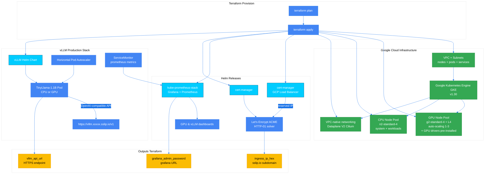

# 🧑🏼‍🚀 vLLM Production Stack on Google GKE with Terraform


<!-- canvas.md -->

 
✍🏼 This Terraform stack delivers a **production-ready vLLM serving environment** on Azure AKS supporting both CPU/GPU inference with operational best practices, automated SSL/TLS certificate management via Let's Encrypt, and comprehensive observability.
| Project Item | Description |
|--------------|-------------|
| **Author** | [@cloudthrill](https://cloudthrill.ca) |
| **Stack** | Terraform ◦ GCP ◦ GKE ◦ Dataplane V2 (Cilium) ◦ Helm ◦ vLLM |
| **Module** | Production-ready GKE private cluster with vLLM serving |
| **CNI** | VPC-native networking with **Dataplane V2 (eBPF/Cilium)** |
| **Inference hardware** | Either CPU or GPU through a switch flag |

---

## 📋 Table of Contents

1. [Project Structure](#-project-structure)
2. [Prerequisites](#-prerequisites)
3. [What Terraform Deploys](#%EF%B8%8F-what-terraform-deploys)
4. [Hardware Options](#-hardware-options)
5. [Configuration Options](#%EF%B8%8Fconfiguration-options)
6. [Quick Start](#-quick-start)
7. [Quick Test](#-quick-test)
8. [Observability](#-observability)
9. [Troubleshooting](#-troubleshooting)
10. [Cleanup Notes](#-cleanup-notes)
11. [Additional Resources](#-additional-resources)

---

## 📂 Project Structure
```bash
./
├── main.tf                          # Project + GKE cluster
├── network.tf                       # VPC, subnet, NAT, reserved IPs
├── provider.tf                      # GCP + Helm + kubectl providers
├── variables.tf                     # All input variables
├── output.tf                        # HTTPS endpoints, kubeconfig
├── cluster-tools.tf                 # cert-manager, prometheus, GPU operator
├── datasources.tf                   # Ingress data sources
├── vllm-production-stack.tf         # vLLM Helm release, BackendConfig, dashboards
├── env-vars.template                # Quick env exporter
├── terraform.tfvars.template        # Same as HCL
├── modules/
│   ├── private-cluster-update-variant/  # GKE cluster (upstream)
│   │   ├── cluster.tf
│   │   ├── dns.tf
│   │   ├── firewall.tf
│   │   ├── main.tf
│   │   ├── networks.tf
│   │   ├── outputs.tf
│   │   ├── variables.tf
│   │   └── versions.tf
│   ├── google-network/                  # VPC + subnet + NAT (upstream)
│   │   ├── main.tf
│   │   ├── variables.tf
│   │   ├── outputs.tf
│   │   ├── versions.tf
│   │   └── modules/
│   │       ├── vpc/
│   │       ├── subnets/
│   │       ├── routes/
│   │       └── firewall-rules/
│   ├── google-project-factory/          # Optional new project (upstream)
│   │   ├── main.tf
│   │   ├── variables.tf
│   │   ├── outputs.tf
│   │   └── modules/
│   │       ├── core_project_factory/
│   │       └── project_services/
│   └── llm-stack/                       # vLLM Helm value templates
│       └── helm/
│           ├── cpu/
│           │   └── cpu-tinyllama-light-ingress-gcp.tpl
│           └── gpu/
│               ├── gpu-operator-values.yaml
│               └── gpu-tinyllama-light-ingress-gcp.tpl
├── config/
│   ├── helm/
│   │   └── kube-prome-stack.yaml        # Grafana + Prometheus values
│   ├── manifests/
│   │   └── letsencrypt-issuer.yaml      # Let's Encrypt ClusterIssuer
│   ├── kubeconfig.tpl                   # Local kubeconfig
│   └── vllm-dashboard.json              # Grafana vLLM dashboard
└── README.md                            # ← you are here
```

---

## ✅ Prerequisites

| Tool | Version | Notes |
|------|---------|-------|
| **Terraform** | ≥ 1.3 | Tested on 1.10+ |
| **Terraform Provider for GCP** | ≥ 6.41+ | hashicorp/google provider |
| **gcloud CLI** | ≥ 450.0 | For authentication , tested on 529.0|
| **kubectl** | ≥ 1.9.x | Kubernetes CLI |
| **jq** | optional | JSON helper |

<details>
<summary><b>Install tools (Ubuntu/Debian) 👇🏼</b></summary>

```bash
# Install tools
sudo apt update && sudo apt install -y jq curl unzip gpg

  # Terraform
wget -qO- https://apt.releases.hashicorp.com/gpg | sudo gpg --dearmor -o /usr/share/keyrings/hashicorp-archive-keyring.gpg
echo "deb [signed-by=/usr/share/keyrings/hashicorp-archive-keyring.gpg] https://apt.releases.hashicorp.com $(lsb_release -cs) main" | sudo tee /etc/apt/sources.list.d/hashicorp.list
sudo apt update && sudo apt install -y terraform

# Google Cloud SDK
curl https://sdk.cloud.google.com | bash
exec -l $SHELL
gcloud init

# kubectl
curl -sLO "https://dl.k8s.io/release/$(curl -Ls https://dl.k8s.io/release/stable.txt)/bin/linux/amd64/kubectl"
sudo install kubectl /usr/local/bin/ && rm kubectl
```
</details>

**Configure Google Cloud**
```bash
# Login to GCP
gcloud auth login
gcloud auth application-default login

# Set project
gcloud config set project YOUR_PROJECT_ID

# Enable required APIs
gcloud services enable container.googleapis.com compute.googleapis.com servicenetworking.googleapis.com

# Verify
gcloud config list
```

---

## 🏗️ What Terraform Deploys

<div align="center">

| Layer | Component | CPU Mode | GPU Mode |
|-------|-----------|----------|----------|
| **Infrastructure** | VPC + GKE + Dataplane V2 | ✅ Always deployed | ✅ Always deployed |
| **Add-ons** | Persistent Disk CSI, cert-manager, Prometheus | ✅ Always deployed | ✅ Always deployed |
| **vLLM Stack** | Secrets + Helm chart | ✅ Deploy on CPU nodes | ✅ + GPU nodes (drivers pre-installed) |
| **Networking** | Reserved IPs + Ingress + TLS + Let's Encrypt | ✅ GKE native ingress + cert-manager | ✅ GKE native ingress + cert-manager |

</div>

### 1. 📶 Networking

* Custom VPC with 3 IP ranges (nodes, pods, services)
* **VPC-native networking** with Dataplane V2 (Cilium eBPF)
* Private GKE cluster with Cloud NAT for outbound traffic
* Reserved external IPs for ingress endpoints
* Automated SSL/TLS certificates via cert-manager + Let's Encrypt
* Network security with Dataplane V2 network policies

### 2. ☸️ GKE Cluster

* Private cluster v1.30 (zonal or regional)
* Managed node pools with auto-scaling

| Pool | Machine Type | Purpose |
|------|--------------|---------|
| `cpu-pool` | **n2-standard-4** (4 vCPU / 16 GiB) | System services & CPU inference |
| `gpu-pool` *(optional)* | **g2-standard-4 + L4** (1 × NVIDIA L4) | GPU inference |

### 3. 📦 Add-ons

Core GKE add-ons via [terraform-google-kubernetes-engine](https://github.com/terraform-google-modules/terraform-google-kubernetes-engine) private-cluster-update-variant:

| Category | Add-on |
|----------|--------|
| **CNI** | **VPC-native networking** with Dataplane V2 (Cilium eBPF) |
| **Storage** | **Persistent Disk CSI** (block, pre-installed)<br/>**Filestore CSI** (shared, optional) |
| **Ingress** | **GKE Native Ingress** with reserved external IPs |
| **SSL/TLS** | **cert-manager** + Let's Encrypt ClusterIssuer |
| **Core** | CoreDNS, kube-proxy (eBPF mode), Metrics Server (built-in) |
| **Observability** | kube-prometheus-stack, Grafana |
| **GPU** (optional) | NVIDIA GPU drivers (pre-installed by GKE via `gpu_driver_version`) |

### 4. 🧠 vLLM Production Stack (CPU/GPU)

* **Model**: TinyLlama-1.1B (default, customizable)
* **Load balancing**: GKE native ingress with BackendConfig
* **Secrets**: Hugging Face token stored as Kubernetes Secret
* **Storage**: Init container with persistent model caching
* **HTTPS endpoints**: Automated TLS via Let's Encrypt with reserved IPs
* **Default Helm charts**: [cpu-tinyllama-light-ingress-gcp](./modules/llm-stack/helm/cpu/) | [gpu-tinyllama-light-ingress-gcp](./modules/llm-stack/helm/gpu/)

---

## 💡 Hardware Options

You can choose to deploy vLLM production stack on either CPU or GPU using the `inference_hardware` parameter:

<div align="center">

| Mode | Setting | Resources |
|------|---------|-----------|
| **CPU** | `inference_hardware = "cpu"` | Uses existing CPU nodes (n2-standard-4) |
| **GPU** | `inference_hardware = "gpu"` | Provisions GPU nodes (g2-standard-4 + L4, drivers pre-installed) |

</div>

## 🖥️ GCP GPU Machine Types

( P4 · V100 · P100 · A100 · L4 , etc). Read the full list [here](https://cloud.google.com/compute/docs/gpus).

<details><summary><b>Available GPU configurations</b></summary>

| Machine Type + GPU | vCPUs | Memory (GiB) | GPUs | GPU Memory (GiB) | Best For |
|--------------------|-------|--------------|------|------------------|----------|
| **NVIDIA L4** |
| `g2-standard-4` + L4 | 4 | 16 | 1 | 24 | Cost-effective inference |
| `g2-standard-8` + L4 | 8 | 32 | 1 | 24 | Medium inference |
| `g2-standard-16` + 2×L4 | 16 | 64 | 2 | 48 | Multi-GPU inference |
| **NVIDIA Tesla T4** |
| `n1-standard-4` + T4 | 4 | 15 | 1 | 16 | Legacy inference workloads |
| `n1-standard-8` + T4 | 8 | 30 | 1 | 16 | Medium inference |
| **NVIDIA Tesla V100** |
| `n1-standard-8` + V100 | 8 | 30 | 1 | 16 | Training & inference |
| `n1-standard-16` + 2×V100 | 16 | 60 | 2 | 32 | Multi-GPU training |
| **NVIDIA A100 (40GB)** |
| `a2-highgpu-1g` | 12 | 85 | 1 | 40 | High-performance inference |
| `a2-highgpu-2g` | 24 | 170 | 2 | 80 | Multi-GPU inference |
| `a2-highgpu-4g` | 48 | 340 | 4 | 160 | Large-scale training |

</details>

## GPU Specifications

| GPU Type | Best For | Relative Cost |
|----------|----------|---------------|
| NVIDIA L4 | Modern inference, video transcoding | $ |
| NVIDIA Tesla T4 | ML inference, small-scale training | $ |
| NVIDIA Tesla P4 | Inference optimization | $ |
| NVIDIA Tesla V100 | Large-scale ML training & inference | $$$ |
| NVIDIA A100 | Cutting-edge AI workloads | $$$$ |

---

## 🛠️ Configuration Options

This stack provides extensive customization options. Here are the most important:

| Variable | Default | Description |
|----------|---------|-------------|
| `project_id` | **required** | GCP project ID |
| `region` | `us-central1` | GCP region |
| `cluster_version` | `1.30` | Kubernetes version |
| `inference_hardware` | `cpu` | `cpu` or `gpu` |
| `pod_cidr` | `10.244.0.0/16` | Pod IP range |
| `enable_vllm` | `false` | Deploy vLLM stack |
| `hf_token` | **«secret»** | HF model download token |
| `enable_prometheus` | `true` | Prometheus-Grafana stack |
| `enable_cert_manager` | `true` | cert-manager for TLS |
| `letsencrypt_email` | `admin@example.com` | Email for Let's Encrypt |

### 📋 Complete Configuration Options

**This is just a subset of available variables.** For the full list of 50+ configurable options including:

* **Project creation** (new vs existing project)
* **Node pool** sizing (CPU/GPU pools)
* **Storage options** (Persistent Disk/Filestore)
* **Observability stack** (Prometheus/Grafana)
* **Security settings** (cert-manager, Workload Identity)
* **Network configuration** (VPC CIDR, subnet ranges, private cluster)

**📓** See the complete configuration templates:

* **Environment variables**: [`env-vars.template`](./env-vars.template)
* **Terraform variables**: [`terraform.tfvars.template`](./terraform.tfvars.template)

<details><summary><b> Full list of variables</b></summary>
    
## Requirements

| Name | Version |
|------|---------|
| <a name="requirement_terraform"></a> [terraform](#requirement\_terraform) | >= 1.3, < 2.0 |
| <a name="requirement_google"></a> [google](#requirement\_google) | >= 6.27.0, < 7 |
| <a name="requirement_google-beta"></a> [google-beta](#requirement\_google-beta) | >= 4.64, < 7 |
| <a name="requirement_helm"></a> [helm](#requirement\_helm) | >= 2.15 |
| <a name="requirement_kubectl"></a> [kubectl](#requirement\_kubectl) | >= 1.19.0 |
| <a name="requirement_kubernetes"></a> [kubernetes](#requirement\_kubernetes) | ~> 2.10 |
| <a name="requirement_local"></a> [local](#requirement\_local) | >= 2.5 |
| <a name="requirement_random"></a> [random](#requirement\_random) | >= 2.1 |

## Providers

| Name | Version |
|------|---------|
| <a name="provider_google"></a> [google](#provider\_google) | >= 6.27.0, < 7 |
| <a name="provider_helm"></a> [helm](#provider\_helm) | >= 2.15 |
| <a name="provider_kubectl"></a> [kubectl](#provider\_kubectl) | >= 1.19.0 |
| <a name="provider_kubernetes"></a> [kubernetes](#provider\_kubernetes) | ~> 2.10 |
| <a name="provider_local"></a> [local](#provider\_local) | >= 2.5 |
| <a name="provider_random"></a> [random](#provider\_random) | >= 2.1 |
| <a name="provider_template"></a> [template](#provider\_template) | n/a |

## Modules

| Name | Source | Version |
|------|--------|---------|
| <a name="module_gke"></a> [gke](#module\_gke) | ./modules/private-cluster-update-variant | n/a |
| <a name="module_vllm_gke_project"></a> [vllm\_gke\_project](#module\_vllm\_gke\_project) | ./modules/google-project-factory | n/a |
| <a name="module_vpc"></a> [vpc](#module\_vpc) | ./modules/google-network | n/a |

## Resources

| Name | Type |
|------|------|
| [google_compute_global_address.ingress_ip](https://registry.terraform.io/providers/hashicorp/google/latest/docs/resources/compute_global_address) | resource |
| [google_compute_global_address.vllm_ip](https://registry.terraform.io/providers/hashicorp/google/latest/docs/resources/compute_global_address) | resource |
| [google_compute_router.router](https://registry.terraform.io/providers/hashicorp/google/latest/docs/resources/compute_router) | resource |
| [google_compute_router_nat.nat](https://registry.terraform.io/providers/hashicorp/google/latest/docs/resources/compute_router_nat) | resource |
| [google_project_service.existing_project_services](https://registry.terraform.io/providers/hashicorp/google/latest/docs/resources/project_service) | resource |
| [helm_release.cert_manager](https://registry.terraform.io/providers/hashicorp/helm/latest/docs/resources/release) | resource |
| [helm_release.kube_prometheus_stack](https://registry.terraform.io/providers/hashicorp/helm/latest/docs/resources/release) | resource |
| [helm_release.vllm_stack](https://registry.terraform.io/providers/hashicorp/helm/latest/docs/resources/release) | resource |
| [kubectl_manifest.letsencrypt_issuer](https://registry.terraform.io/providers/gavinbunney/kubectl/latest/docs/resources/manifest) | resource |
| [kubectl_manifest.vllm_router_backend](https://registry.terraform.io/providers/gavinbunney/kubectl/latest/docs/resources/manifest) | resource |
| [kubectl_manifest.vllm_service_monitor](https://registry.terraform.io/providers/gavinbunney/kubectl/latest/docs/resources/manifest) | resource |
| [kubernetes_config_map.vllm_dashboard](https://registry.terraform.io/providers/hashicorp/kubernetes/latest/docs/resources/config_map) | resource |
| [kubernetes_namespace.vllm](https://registry.terraform.io/providers/hashicorp/kubernetes/latest/docs/resources/namespace) | resource |
| [kubernetes_secret.hf_token](https://registry.terraform.io/providers/hashicorp/kubernetes/latest/docs/resources/secret) | resource |
| [local_file.kubeconfig](https://registry.terraform.io/providers/hashicorp/local/latest/docs/resources/file) | resource |
| [random_id.project_suffix](https://registry.terraform.io/providers/hashicorp/random/latest/docs/resources/id) | resource |
| [google_client_config.default](https://registry.terraform.io/providers/hashicorp/google/latest/docs/data-sources/client_config) | data source |
| [google_compute_network.existing](https://registry.terraform.io/providers/hashicorp/google/latest/docs/data-sources/compute_network) | data source |
| [google_compute_subnetwork.existing](https://registry.terraform.io/providers/hashicorp/google/latest/docs/data-sources/compute_subnetwork) | data source |
| [google_compute_zones.zonal_available](https://registry.terraform.io/providers/hashicorp/google/latest/docs/data-sources/compute_zones) | data source |
| [google_project.current](https://registry.terraform.io/providers/hashicorp/google/latest/docs/data-sources/project) | data source |
| [kubernetes_ingress_v1.grafana](https://registry.terraform.io/providers/hashicorp/kubernetes/latest/docs/data-sources/ingress_v1) | data source |
| [kubernetes_resources.vllm_ingresses](https://registry.terraform.io/providers/hashicorp/kubernetes/latest/docs/data-sources/resources) | data source |
| [template_file.vllm_values](https://registry.terraform.io/providers/hashicorp/template/latest/docs/data-sources/file) | data source |

## Inputs

| Name | Description | Type | Default | Required |
|------|-------------|------|---------|:--------:|
| <a name="input_api_private_access"></a> [api\_private\_access](#input\_api\_private\_access) | n/a | `bool` | `true` | no |
| <a name="input_api_public_access"></a> [api\_public\_access](#input\_api\_public\_access) | API endpoint exposure | `bool` | `true` | no |
| <a name="input_cluster_name"></a> [cluster\_name](#input\_cluster\_name) | GKE cluster name. | `string` | `"vllm-gke"` | no |
| <a name="input_cluster_version"></a> [cluster\_version](#input\_cluster\_version) | Kubernetes version. | `string` | `"1.30"` | no |
| <a name="input_cpu_disk_type"></a> [cpu\_disk\_type](#input\_cpu\_disk\_type) | Disk type for CPU nodes (pd-standard, pd-ssd, pd-balanced) | `string` | `"pd-standard"` | no |
| <a name="input_cpu_node_max_size"></a> [cpu\_node\_max\_size](#input\_cpu\_node\_max\_size) | n/a | `number` | `2` | no |
| <a name="input_cpu_node_min_size"></a> [cpu\_node\_min\_size](#input\_cpu\_node\_min\_size) | n/a | `number` | `1` | no |
| <a name="input_cpu_os_disk_size_gb"></a> [cpu\_os\_disk\_size\_gb](#input\_cpu\_os\_disk\_size\_gb) | OS disk size for CPU nodes | `number` | `50` | no |
| <a name="input_cpu_vllm_helm_config"></a> [cpu\_vllm\_helm\_config](#input\_cpu\_vllm\_helm\_config) | Path to the Helm chart values template for CPU inference. | `string` | `"modules/llm-stack/helm/cpu/cpu-tinyllama-light-ingress-gcp.tpl"` | no |
| <a name="input_create_project"></a> [create\_project](#input\_create\_project) | Whether to create a new project or use existing provider project | `bool` | `false` | no |
| <a name="input_create_vpc"></a> [create\_vpc](#input\_create\_vpc) | Create a new VPC (true) or reuse an existing one (false). | `bool` | `true` | no |
| <a name="input_enable_cert_manager"></a> [enable\_cert\_manager](#input\_enable\_cert\_manager) | n/a | `bool` | `true` | no |
| <a name="input_enable_cert_manager_cluster_issuer"></a> [enable\_cert\_manager\_cluster\_issuer](#input\_enable\_cert\_manager\_cluster\_issuer) | n/a | `bool` | `true` | no |
| <a name="input_enable_disk_csi_driver"></a> [enable\_disk\_csi\_driver](#input\_enable\_disk\_csi\_driver) | n/a | `bool` | `true` | no |
| <a name="input_enable_external_secrets"></a> [enable\_external\_secrets](#input\_enable\_external\_secrets) | n/a | `bool` | `true` | no |
| <a name="input_enable_file_csi_driver"></a> [enable\_file\_csi\_driver](#input\_enable\_file\_csi\_driver) | n/a | `bool` | `false` | no |
| <a name="input_enable_file_storage"></a> [enable\_file\_storage](#input\_enable\_file\_storage) | Enable azure file storage resources for debugging | `bool` | `false` | no |
| <a name="input_enable_grafana"></a> [enable\_grafana](#input\_enable\_grafana) | n/a | `bool` | `true` | no |
| <a name="input_enable_keda"></a> [enable\_keda](#input\_enable\_keda) | Enable KEDA for workload autoscaling. | `bool` | `false` | no |
| <a name="input_enable_metrics_server"></a> [enable\_metrics\_server](#input\_enable\_metrics\_server) | n/a | `bool` | `true` | no |
| <a name="input_enable_private_endpoint"></a> [enable\_private\_endpoint](#input\_enable\_private\_endpoint) | Enable private endpoint for master access | `bool` | `false` | no |
| <a name="input_enable_private_nodes"></a> [enable\_private\_nodes](#input\_enable\_private\_nodes) | Enable private nodes (nodes have internal IPs only) | `bool` | `true` | no |
| <a name="input_enable_prometheus"></a> [enable\_prometheus](#input\_enable\_prometheus) | n/a | `bool` | `true` | no |
| <a name="input_enable_vllm"></a> [enable\_vllm](#input\_enable\_vllm) | Enable VLLM production stack add-on | `bool` | `false` | no |
| <a name="input_enable_vpa"></a> [enable\_vpa](#input\_enable\_vpa) | Enable Vertical Pod Autoscaler (VPA). | `bool` | `false` | no |
| <a name="input_gcp_services"></a> [gcp\_services](#input\_gcp\_services) | List of GCP services required for GKE project | `list(string)` | <pre>[<br/>  "container.googleapis.com",<br/>  "compute.googleapis.com",<br/>  "iam.googleapis.com",<br/>  "monitoring.googleapis.com",<br/>  "logging.googleapis.com",<br/>  "cloudtrace.googleapis.com",<br/>  "stackdriver.googleapis.com",<br/>  "servicenetworking.googleapis.com",<br/>  "networkmanagement.googleapis.com",<br/>  "storage-api.googleapis.com",<br/>  "artifactregistry.googleapis.com",<br/>  "dns.googleapis.com",<br/>  "certificatemanager.googleapis.com",<br/>  "containeranalysis.googleapis.com",<br/>  "binaryauthorization.googleapis.com",<br/>  "cloudkms.googleapis.com"<br/>]</pre> | no |
| <a name="input_gpu_disk_type"></a> [gpu\_disk\_type](#input\_gpu\_disk\_type) | Disk type for GPU nodes (pd-standard, pd-ssd, pd-balanced) | `string` | `"pd-ssd"` | no |
| <a name="input_gpu_node_max_size"></a> [gpu\_node\_max\_size](#input\_gpu\_node\_max\_size) | n/a | `number` | `1` | no |
| <a name="input_gpu_node_min_size"></a> [gpu\_node\_min\_size](#input\_gpu\_node\_min\_size) | n/a | `number` | `1` | no |
| <a name="input_gpu_operator_file"></a> [gpu\_operator\_file](#input\_gpu\_operator\_file) | Path to GPU Operator Helm values YAML. | `string` | `"modules/llm-stack/helm/gpu/gpu-operator-values.yaml"` | no |
| <a name="input_gpu_os_disk_size_gb"></a> [gpu\_os\_disk\_size\_gb](#input\_gpu\_os\_disk\_size\_gb) | OS disk size for GPU nodes | `number` | `100` | no |
| <a name="input_gpu_vllm_helm_config"></a> [gpu\_vllm\_helm\_config](#input\_gpu\_vllm\_helm\_config) | Path to the Helm chart values template for GPU inference. | `string` | `"modules/llm-stack/helm/gpu/gpu-tinyllama-light-ingress-gcp.tpl"` | no |
| <a name="input_grafana_admin_password"></a> [grafana\_admin\_password](#input\_grafana\_admin\_password) | Grafana admin password. | `string` | `"admin1234"` | no |
| <a name="input_hf_token"></a> [hf\_token](#input\_hf\_token) | Hugging Face access token with model-download scope | `string` | n/a | yes |
| <a name="input_image_cleaner_enabled"></a> [image\_cleaner\_enabled](#input\_image\_cleaner\_enabled) | Enable image cleaner to remove unused images. | `bool` | `true` | no |
| <a name="input_image_cleaner_interval_hours"></a> [image\_cleaner\_interval\_hours](#input\_image\_cleaner\_interval\_hours) | Interval in hours for the image cleaner to run. | `number` | `24` | no |
| <a name="input_inference_hardware"></a> [inference\_hardware](#input\_inference\_hardware) | Choose the hardware profile for inference workloads.<br/>• "cpu" → only the default CPU node‑group<br/>• "gpu" → CPU node‑group + a GPU node‑group (g4dn.xlarge, 1 node) | `string` | `"cpu"` | no |
| <a name="input_letsencrypt_email"></a> [letsencrypt\_email](#input\_letsencrypt\_email) | n/a | `string` | `"admin@example.com"` | no |
| <a name="input_managed_identities"></a> [managed\_identities](#input\_managed\_identities) | Managed identities for AKS. | `list(string)` | `[]` | no |
| <a name="input_master_ipv4_cidr_block"></a> [master\_ipv4\_cidr\_block](#input\_master\_ipv4\_cidr\_block) | CIDR block for GKE master network | `string` | `"172.16.0.0/28"` | no |
| <a name="input_network_project_id"></a> [network\_project\_id](#input\_network\_project\_id) | The project ID of the shared VPC's host (for shared vpc support) | `string` | `""` | no |
| <a name="input_os_image_type"></a> [os\_image\_type](#input\_os\_image\_type) | Image type for CPU nodes | `string` | `"COS_CONTAINERD"` | no |
| <a name="input_pod_cidr"></a> [pod\_cidr](#input\_pod\_cidr) | Overlay pod network | `string` | `"10.244.0.0/16"` | no |
| <a name="input_pod_range_name"></a> [pod\_range\_name](#input\_pod\_range\_name) | Name of secondary IP range for pods | `string` | `"pods-range"` | no |
| <a name="input_project_id"></a> [project\_id](#input\_project\_id) | GCP project ID for the GKE cluster | `string` | n/a | yes |
| <a name="input_region"></a> [region](#input\_region) | GCP region for the cluster | `string` | `"us-central1"` | no |
| <a name="input_regional"></a> [regional](#input\_regional) | n/a | `bool` | `false` | no |
| <a name="input_run_command_enabled"></a> [run\_command\_enabled](#input\_run\_command\_enabled) | Enable run command for executing commands on nodes. | `bool` | `true` | no |
| <a name="input_service_cidr"></a> [service\_cidr](#input\_service\_cidr) | CIDR block for service IPs | `string` | `"10.96.0.0/16"` | no |
| <a name="input_service_range_name"></a> [service\_range\_name](#input\_service\_range\_name) | Name of secondary IP range for services | `string` | `"services-range"` | no |
| <a name="input_subnetwork_cidr"></a> [subnetwork\_cidr](#input\_subnetwork\_cidr) | Primary CIDR for the subnetwork | `string` | `"10.20.1.0/24"` | no |
| <a name="input_subnetwork_name"></a> [subnetwork\_name](#input\_subnetwork\_name) | Name of the subnetwork for GKE cluster | `string` | `"vllm-subnet"` | no |
| <a name="input_tags"></a> [tags](#input\_tags) | Tags applied to all Azure resources. | `map(string)` | <pre>{<br/>  "application": "ai-inference",<br/>  "costcenter": "ai-1234",<br/>  "environment": "production",<br/>  "project": "vllm-production-stack",<br/>  "team": "llmops"<br/>}</pre> | no |
| <a name="input_vpc_cidr"></a> [vpc\_cidr](#input\_vpc\_cidr) | CIDR block for the VPC (informational - GCP auto-assigns). | `string` | `"10.20.0.0/16"` | no |
| <a name="input_vpc_id"></a> [vpc\_id](#input\_vpc\_id) | Existing VPC ID (required when create\_vpc = false). | `string` | `""` | no |
| <a name="input_vpc_name"></a> [vpc\_name](#input\_vpc\_name) | Name for the VPC network. | `string` | `"vllm-vpc"` | no |
| <a name="input_zones"></a> [zones](#input\_zones) | GCP zones for the cluster | `list(string)` | `[]` | no |

## Outputs

| Name | Description |
|------|-------------|
| <a name="output_LB-IP-Address"></a> [LB-IP-Address](#output\_LB-IP-Address) | n/a |
| <a name="output_gke_cluster_id"></a> [gke\_cluster\_id](#output\_gke\_cluster\_id) | Cluster ID of the GKE cluster |
| <a name="output_gke_deployment_info"></a> [gke\_deployment\_info](#output\_gke\_deployment\_info) | Complete GKE deployment information |
| <a name="output_gke_endpoint"></a> [gke\_endpoint](#output\_gke\_endpoint) | GKE cluster API server endpoint |
| <a name="output_gke_location"></a> [gke\_location](#output\_gke\_location) | Location (region/zone) of the GKE cluster |
| <a name="output_gke_master_version"></a> [gke\_master\_version](#output\_gke\_master\_version) | Current master Kubernetes version |
| <a name="output_gke_name"></a> [gke\_name](#output\_gke\_name) | Name of the Kubernetes cluster |
| <a name="output_gke_region"></a> [gke\_region](#output\_gke\_region) | Region of the GKE cluster |
| <a name="output_gpu_driver_status"></a> [gpu\_driver\_status](#output\_gpu\_driver\_status) | GPU driver installation status |
| <a name="output_grafana_url"></a> [grafana\_url](#output\_grafana\_url) | n/a |
| <a name="output_vllm_api_url"></a> [vllm\_api\_url](#output\_vllm\_api\_url) | The full HTTPS URL for the vLLM API |   

</details>

---

## 🚀 Quick Start
### ⚙️ Provisioning logic

| Phase | Component | Action | Condition |
|-------|-----------|--------|-----------|
| **1. Project** | GCP Project | Create new project (optional) | `create_project = true` |
| | API Services | Enable required GCP APIs | Always |
| **2. Infrastructure** | VPC | Create VPC with subnets + secondary ranges | Always |
| | NAT Gateway | Configure Cloud NAT for private nodes | Always |
| | Reserved IPs | Create external IPs for ingress | Always |
| | GKE | Deploy v1.30 private cluster + CPU node pool | Always |
| | Dataplane V2 | Enable eBPF-based networking (Cilium) | Always |
| **3. SSL/TLS** | cert-manager | Install cert-manager | Always |
| | ClusterIssuer | Create Let's Encrypt **production** ClusterIssuer | Always |
| **4. vLLM Stack** | HF secret | Create Hugging Face token secret | `enable_vllm = true` |
| | CPU Deployment | Deploy vLLM on CPU nodes | `inference_hardware = "cpu"` |
| | GPU Infrastructure | Provision GPU node pool | `inference_hardware = "gpu"` |
| | GPU Drivers | Pre-installed by GKE | `inference_hardware = "gpu"` |
| | Helm chart | Deploy TinyLlama-1.1B with HTTPS ingress | `enable_vllm = true` |
| **5. Observability** | Prometheus/Grafana | Deploy stack + vLLM dashboard | Always |
---

## 🔵 Deployment Steps

### 1️⃣ Clone the repository
```bash
git clone https://github.com/CloudThrill/vllm-production-stack-terraform
cd vllm-production-stack-terraform/gke/
```

### 2️⃣ Set Up Environment Variables
```bash
cp env-vars.template env-vars
vim env-vars  # Set GCP project, HF token, and customize options
source env-vars
```

**Key variables to set:**
```bash
export TF_VAR_project_id="your-gcp-project-id"
export TF_VAR_region="us-central1"
export TF_VAR_hf_token="hf_your_token_here"
export TF_VAR_letsencrypt_email="your-email@email.com"
export TF_VAR_inference_hardware="gpu"  # or "cpu"
export TF_VAR_enable_vllm=true
export TF_VAR_create_project="false"  
export TF_VAR_create_vpc="true" 
export TF_VAR_enable_disk_csi_driver="true"  
export TF_VAR_enable_file_csi_driver="false"  
export TF_VAR_grafana_admin_password="admin1234"  
```
### 3️⃣ Make sure your gcloud authentication is fresh 
Run the below, if Google’s “**Re-authentication for privileged access**” (RAPT) has expired
```
gcloud auth application-default login --no-launch-browser
```
### 4️⃣ Run Terraform deployment
```bash
# Initialize Terraform
terraform init

# Preview changes
terraform plan

# Deploy (approx. 20-25 minutes)
terraform apply
```
After the deployment you should be able to interact with the cluster using kubectl:
```bash
export KUBECONFIG=$PWD/kubeconfig
```


---

## 🧪 Quick Test

### 1. Access the vLLM API

**Get the HTTPS URL:**
```bash
# Extract from Terraform output
export VLLM_API_URL=$(terraform output -raw vllm_api_url)

# Example output:
# https://vllm.a1b2c3d4.nip.io/v1
```

**Or manually check ingress:**
```bash
kubectl get ingress -n vllm
```

### 2. List Available Models
```bash
curl -s ${VLLM_API_URL}/models | jq .
```

**Expected output:**
```json
{
  "object": "list",
  "data": [
    {
      "id": "/data/models/tinyllama",
      "object": "model",
      "created": 1234567890,
      "owned_by": "vllm"
    }
  ]
}
```

### 3. Test Inference
```bash
curl ${VLLM_API_URL}/completions \
  -H "Content-Type: application/json" \
  -d '{
    "model": "/data/models/tinyllama",
    "prompt": "Google Cloud is a",
    "max_tokens": 20,
    "temperature": 0
  }' | jq .choices[].text
```

**Example response:**
```
"platform that provides computing services for building and deploying applications at scale"
```

---

## 🔬 Observability

### Access Grafana
```bash
# Get Grafana HTTPS URL (already printed by Terraform)
terraform output -raw  grafana_url 
# Or port forward
kubectl port-forward svc/kube-prometheus-stack-grafana 3000:80 -n kube-prometheus-stack

# Open http://localhost:3000  or  https://grafana.xxxxx.nip.io
```

**Login credentials:**
- Username: `admin`
- Password: Retrieve with:
```bash
kubectl get secret -n kube-prometheus-stack kube-prometheus-stack-grafana -o jsonpath="{.data.admin-password}" | base64 --decode
```


### Pre-configured Dashboards

The stack automatically configures: **vLLM Metrics Dashboard**: Model performance, latency, throughput, and key performance indicators.

---

## 🎯 Troubleshooting

  ### Issue 1: Certificate Not Issuing

  **Symptom:**
  ```bash
  kubectl get certificate -n vllm
  # STATUS: Pending or False
  ```

  **Debug:**

```bash
# Check certificate status
kubectl describe certificate -n vllm

# Check cert-manager logs
kubectl logs -n cert-manager -l app=cert-manager --tail=100

# Check HTTP-01 challenge
kubectl get challenge -n vllm
```

**Solution**: Ensure ingress has the reserved IP:

```bash
kubectl get ingress -n vllm -o yaml | grep "kubernetes.io/ingress.global-static-ip-name"
```

  ### Issue 2: GPU Nodes Not Ready

  **Symptom:** GPU pods stuck in pending.

  **Debug:**
  ```bash
  # Check node status
  kubectl get nodes -o wide
 
  # Check GPU availability
  kubectl get nodes -o=custom-columns=NAME:.metadata.name,GPU:.status.capacity.'nvidia\.com/gpu'

  # Check GPU drivers (pre-installed on GKE)
  kubectl describe node -l cloud.google.com/gke-accelerator
  ```

  ### Issue 3: GKE API Not Enabled
  
  **Symptom:** Terraform fails with API not enabled error.
  
  **Solution**:
  ```bash
  gcloud services enable container.googleapis.com
  gcloud services enable compute.googleapis.com
  gcloud services enable servicenetworking.googleapis.com
  ```

### Useful gcloud Debugging Commands

```bash
# Check GKE cluster status
gcloud container clusters describe vllm-gke --region us-central1

# Check node pools
gcloud container node-pools list --cluster vllm-gke --region us-central1

# Check Cloud NAT status
gcloud compute routers get-nat-mapping-info vllm-vpc-router --region us-central1
```

---

## 🧹 Cleanup

When you're done, destroy the infrastructure:
```bash
terraform destroy
```

---

## 📚 Additional Resources

* [vLLM Documentation](https://docs.vllm.ai/)
* [GKE Best Practices](https://cloud.google.com/kubernetes-engine/docs/best-practices)
* [terraform-google-kubernetes-engine](https://github.com/terraform-google-modules/terraform-google-kubernetes-engine)
* [Dataplane V2 Documentation](https://cloud.google.com/kubernetes-engine/docs/concepts/dataplane-v2)
* [vLLM Production stack documentation](https://docs.vllm.ai/projects/production-stack/en/latest/)
* [GCP GPU Documentation](https://cloud.google.com/compute/docs/gpus)

---

**Author**: [@cloudthrill](https://cloudthrill.ca)   

> *Part of the CloudThrill Kubernetes contribution to vLLM production-stack project.*


